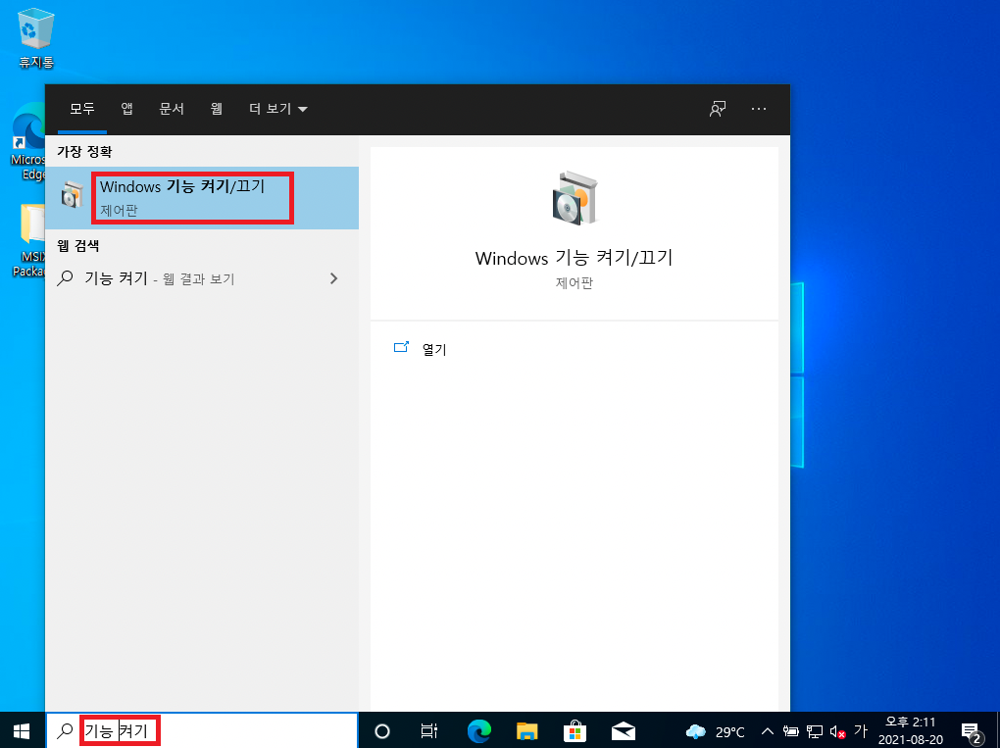
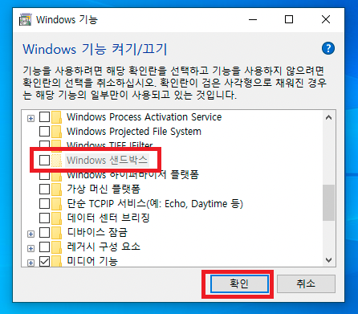

# Windows Sandbox 설치하기

식탁보를 설치하기 전, 먼저 윈도우 샌드박스를 활성화해야 합니다.

- "Windows 기능 켜기/끄기" 어플리케이션을 실행합니다.

  

- "Windows 샌드박스" 기능을 켭니다.

  

샌드박스 기능을 켜거나 끄려면 컴퓨터를 다시 시작해야 하므로, 작업 중인 모든 파일을 저장한 후 컴퓨터를 다시 시작합니다.
