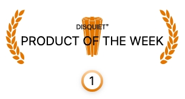

# 식탁보 (TableCloth)

> **언제나 안전하고 깨끗하게!** - 인터넷 뱅킹과 전자정부 서비스를 위한 혁신적인 Windows 샌드박스 솔루션

## 🎯 이런 분들께 추천합니다

- 💻 **인터넷 뱅킹**을 자주 이용하시는 분
- 🏛️ **전자정부 서비스** (홈택스, 정부24 등)를 사용하시는 분
- 🔒 **보안 프로그램**으로 인한 PC 성능 저하에 고민이신 분
- 🧹 **깨끗한 PC 환경**을 유지하고 싶으신 분

### 🤔 이런 문제를 겪고 계신가요?

- ❌ 인터넷 뱅킹 후 설치된 **수많은 보안 프로그램**으로 PC가 느려짐
- ❌ **알 수 없는 프로그램들**이 백그라운드에서 실행되어 불안함
- ❌ 보안 프로그램끼리 **충돌**해서 시스템이 불안정해짐
- ❌ 삭제해도 **완전히 지워지지 않는** 잔여 파일들

### ✨ 식탁보가 해결해드립니다

식탁보는 **Windows의 샌드박스 기능**을 활용하여 인터넷 뱅킹과 전자정부 서비스를 **완전히 격리된 환경**에서 사용할 수 있게 해주는 혁신적인 솔루션입니다.

**🎭 샌드박스란?** 실제 컴퓨터와 완전히 분리된 가상 환경으로, 샌드박스 안에서 일어나는 모든 일은 실제 컴퓨터에 영향을 주지 않습니다.

## ⚡ 핵심 기능

### 🔐 자동 인증서 관리

- **USB 드라이브와 공동인증서**를 샌드박스에 자동 복사
- 작업 완료 후 **자동으로 삭제**되어 보안 걱정 없음

### 📦 스마트 소프트웨어 설치

[카탈로그 시스템](https://yourtablecloth.github.io/TableClothCatalog/Catalog.xml)으로 각 사이트 별 **필요한 프로그램을 한 번에 자동 설치**합니다.

### 🖨️ 프린터가 없어도 걱정하지 마세요

실물 프린터를 찾는 사이트에서도 인쇄물을 PDF로 받아볼 수 있게 해주는 **[모두의 프린터](https://modu-print.tistory.com/)**를 샌드박스 안에서 편하게 설치할 수 있도록 돕습니다.

### 📄 문서 작업 지원

이외에 각종 기관에서 필요로 하는 프로그램의 설치도 샌드박스 안에서 편하게 할 수 있도록 돕습니다.

- **[한컴오피스 뷰어](https://www.hancom.com/cs_center/csDownload.do)** - 아래아한글 (HWP) 문서를 읽거나 인쇄하는 기능을 지원합니다.
- **[Adobe Reader](https://www.adobe.com/kr/acrobat/pdf-reader.html)** - PDF 문서를 보거나, 변환하거나, 양식에 내용을 채우거나 서명하는 작업을 지원합니다.
- **[RaiDrive](https://www.raidrive.com)** - 자주 사용하는 문서, 프로그램, 데이터 파일이 저장된 웹 드라이브와의 연동

## ⚠️ 주의사항

식탁보 사용 중 발생하는 **개인, 기업, 기관의 금전손실, 세금신고 누락** 등 어떠한 장애나 손해에 대해서는 **사용자 본인에게 책임**이 있습니다.

> **중요한 작업의 경우 반드시 실제 PC 환경에서 사용**해야 합니다.

## 🤝 함께 만들어가요

식탁보는 **커뮤니티의 힘**으로 더욱 강력해집니다! 여러분의 작은 기여가 모든 사용자에게 큰 도움이 됩니다.

### 💝 도네이션하기

지속적인 개발을 위해 도네이션해주시면 큰 힘이 됩니다.

### 🎯 이런 도움이 필요해요

#### 📂 [카탈로그 업데이트](https://github.com/yourtablecloth/TableClothCatalog)

- 🔗 **다운로드 링크가 바뀌었나요?** → `Catalog.xml` 수정 PR
- 🆕 **새로운 사이트 추가하고 싶으신가요?** → 사이트 정보 + 아이콘과 함께 PR
- 🌐 **IE 호환성 설정 필요하신가요?** → `sites.xml` 수정 PR

#### 💡 다른 기여 방법

- 🐛 **버그 신고**: [이슈 등록](https://github.com/yourtablecloth/TableCloth/issues)
- 💬 **사용 후기 공유**: 다른 사용자들에게 도움이 됩니다
- 📢 **지인에게 추천**: 가장 큰 도움이에요!

## 🏆 많은 사랑을 받는 식탁보

### 📺 언론에서 주목한 식탁보

- 📰 **[전자신문 2023.10.15]** [PC 성능저하 주범 '인터넷뱅킹 플러그인' 해법 나왔다…윈도 가상머신 활용](https://www.etnews.com/20231013000164)
- 📺 **[1분미만 2023.12.30]** [와..의지의 한국인들이 또 해냈습니다 (진짜 인터넷 개빨라지네요)](https://www.youtube.com/watch?v=tBK6v52EZPE)

### 🥇 수상 내역

#### 🎖️ 2024년 9월 - Disquiet "이 주의 프로덕트"

## �📚 더 알아보기

### 🔗 유용한 링크

- 📖 [식탁보 사용 전 필독사항](need_to_know.md)
- ⚙️ [Windows Sandbox 설치 가이드](howto_install_sandbox.md)
- 🔧 [문제 해결 가이드](troubleshoot.md)
- 🔒 [개인정보 보호정책](privacy.md)

### 📄 라이선스 정보

- 🆓 [MIT 라이선스](https://github.com/yourtablecloth/TableCloth/blob/dev/LICENSE.txt)로 **무료 사용** 가능
- 🎨 아이콘: [Eucalyp](https://www.flaticon.com/authors/eucalyp) from [Flaticon](https://www.flaticon.com/)
- 📸 사진: [Brooke Lark](https://unsplash.com/@brookelark) on [Unsplash](https://unsplash.com/s/photos/tablecloth)
