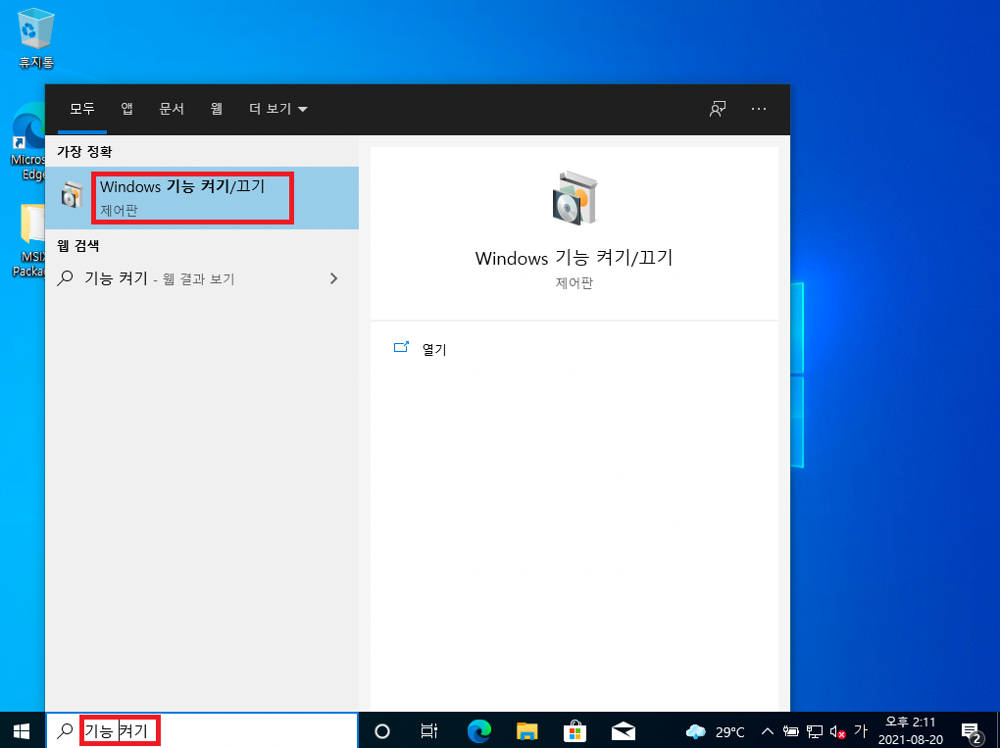
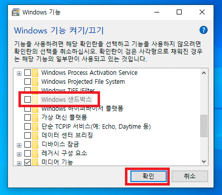

# 식탁보 설치하기

## 1️⃣ 시스템 요구사항 확인

식탁보는 Windows 11 Pro, Enterprise, Education, Pro for Workstation이 필요합니다. (Windows 10의 경우 버전 1909 이상이 필요합니다.)

클라우드 PC, 애플 맥북, 아이맥과 같은 일반적인 PC가 아닌 환경인 경우 아래의 **더 자세한 내용** 단락을 확인해주세요.

## 2️⃣ Windows Sandbox 활성화

식탁보를 설치하기 전, 먼저 윈도우 샌드박스를 활성화해야 합니다.

- "Windows 기능 켜기/끄기" 어플리케이션을 실행합니다.

  

- "Windows 샌드박스" 기능을 켭니다.

  

샌드박스 기능을 켜거나 끄려면 컴퓨터를 다시 시작해야 하므로, 작업 중인 모든 파일을 저장한 후 컴퓨터를 다시 시작합니다.

## 3️⃣ 식탁보 다운로드 및 실행

1. [최신 릴리스](https://github.com/yourtablecloth/TableCloth/releases)에서 다운로드
2. 압축 해제 후 실행
3. 원하는 사이트 선택하고 시작!

## 🔎 더 자세한 내용

- 윈도우 365, 혹은 윈도우 가상 데스크톱 (마이크로소프트 애저 기반), 혹은 Hyper-V 같은 가상 컴퓨터 상에서 식탁보를 이용하고자 할 경우, 해당 서비스 또는 가상 컴퓨터 인스턴스 내에서 추가로 가상화 (혹은 Second Level Address Translation, SLAT) 기능을 지원해야만 윈도우 샌드박스를 활성화할 수 있습니다.

  - 인텔 맥 기반에서는 기술적으로 중첩 가상화를 사용할 수 있는 VM웨어 퓨전, 패러렐즈 같은 가상화 소프트웨어를 사용하여 맥을 벗어나지 않고 식탁보와 Windows Sandbox를 이용할 수는 있습니다. 그러나 실제로 사용하기에는 성능이 많이 떨어져 사용을 권하기 어렵습니다. 대신, 부트캠프 기능을 이용하여 Windows 10 또는 Windows 11로 부팅한 후 식탁보를 사용하는 것을 권장합니다.

  - 애플 실리콘 기반의 맥에서는 2025년 8월 현재 중첩 가상화를 지원하는 ARM용 가상 머신 소프트웨어가 없으므로, Windows 11 최신 버전에서 지원되는 Windows Sandbox를 사용할 수 없습니다.
