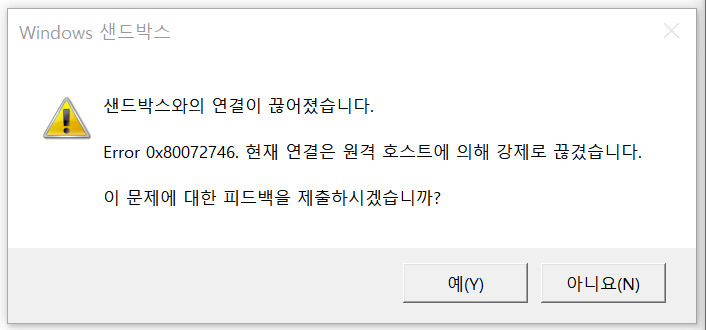
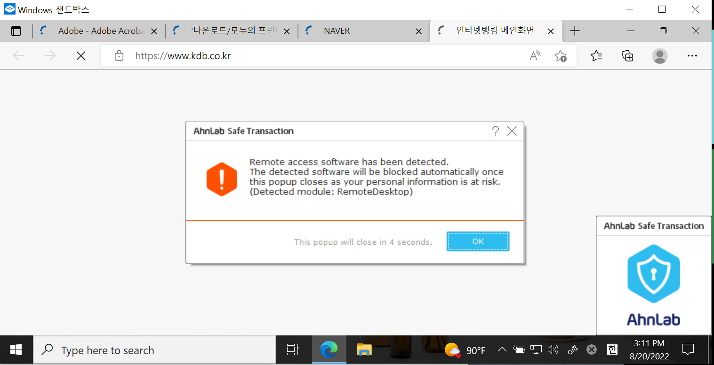

# 문제 해결

## 자주 발생하는 윈도우 샌드박스 오류 일람

식탁보는 윈도우 샌드박스에서 사용하는 WSB 파일을 자동화하는 보조 도구로, 윈도우 샌드박스를 실행하지 못하는 문제는 해결하지 못하거나 개발자가 도움을 드릴 수 없는 경우가 많습니다. 만약 다음과 같은 오류 메시지나 오류 코드가 보인다면 윈도우 샌드박스를 실행할 수 있는 환경이 맞는지 다시 한 번 검토해보시는 것을 권해드립니다.

* `WININET_E_NAME_NOT_RESOLVED` 또는 `WU_E_PT_ENDPOINT_UNREACHABLE`: Windows Sandbox 앱 업그레이드가 실패하는 상황으로 보입니다. 인터넷에 연결되어 있지 않거나 네트워크 어댑터는 연결되어 있지만 인터넷 연결이 없는 상태일 수 있습니다. 인터넷 연결 상태를 확인하세요.
* `ERROR_FILE_NOT_FOUND`: 사용자가 지정한 `.wsb` 구성 파일이 존재하지 않습니다. `.wsb` 파일 경로가 올바른지 확인하세요.
* `E_INVALIDARG`: 제공된 `.wsb` 파일이 잘못되었거나 오류가 있습니다. `.wsb` 파일을 다시 확인하세요.
* `REGDB_E_IIDNOTREG`: Windows 기능 켜기/끄기에서 Windows Sandbox 구성 요소가 활성화되어 있는지 확인하세요. 자세한 내용은 [Windows Sandbox 설치](https://learn.microsoft.com/en-us/windows/security/application-security/application-isolation/windows-sandbox/windows-sandbox-install)를 참고하세요.
* `The following settings are enforced by your IT administrator`: 그룹 정책에 의해 제어되는 설정이 `.wsb` 파일에 포함되어 있습니다.
* `No hypervisor was found. Please enable hypervisor support`: Windows Sandbox는 Hyper-V 하이퍼바이저만 지원합니다. 타사 하이퍼바이저는 지원되지 않습니다. Hyper-V가 활성화되어 있는지 확인하세요.
* `Cannot upgrade to the latest version of Windows Sandbox`: 장치가 인터넷, Windows 업데이트, Microsoft Store에 접근할 수 있는지 확인하세요. Windows 11 24H2부터는 기존 Windows Sandbox 앱이 최신 버전을 Store에서 다운로드하려고 시도합니다. 업그레이드가 처음에 실패해도 설치는 백그라운드에서 계속 진행되며, 사용자는 앱을 계속 사용할 수 있습니다. 또한 Microsoft Store 앱의 "업데이트 및 다운로드" 섹션에서 수동으로 설치할 수도 있습니다.
* `E_FAIL`, `E_UNEXPECTED` 또는 설치 중 일반 오류: 가능한 원인은 Windows Sandbox 설치가 그룹 정책에 의해 비활성화된 경우입니다. IT 관리자에게 문의하세요. 또는 Microsoft Store에 연결할 수 없는 타임아웃 오류일 수 있습니다. 나중에 다시 시도해 보세요.

더 자세한 내용은 [이 문서](https://learn.microsoft.com/en-us/windows/security/application-security/application-isolation/windows-sandbox/windows-sandbox-troubleshoot)를 확인해주십시오.

## 샌드박스가 닫히면서 "현재 연결은 원격 호스트에 의해 강제로 끊겼습니다" 오류 메시지가 나타납니다

Windows Sandbox는 사용자와 상호 작용하는 부분을 Remote Desktop Protocol (RDP)을 이용하여 구현했습니다. 그러나 일부 보안 소프트웨어들은 RDP를 통한 서비스 사용을 의도적으로 차단합니다.

이 문서에서는 가장 잘 알려진 사례인 AhnLab Safe Transaction (이하 AST) 프로그램의 사례에 대한 해결 방법을 안내합니다. 다른 소프트웨어의 경우, 해당 소프트웨어 제조사에 문제 해결을 요청해야 할 수 있습니다.

AST가 RDP를 강제 종료하지 않게 설정을 변경하려면 다음과 같이 설정을 바꿉니다.

1. 작업 표시줄의 트레이 아이콘 영역에서 방패 모양의 AST 아이콘을 마우스 오른쪽 버튼으로 클릭합니다.
1. 팝업 메뉴에서 **Settings** 메뉴를 클릭합니다.
1. 설정 대화 상자가 나타나면, **System Security** 탭을 클릭합니다.
1. **Block remote access** 체크 상자를 해제합니다.
1. **Close** 버튼을 클릭합니다.
1. 보안이 취약해질 수 있다는 경고 메시지가 나타나면, **Yes** 버튼을 눌러 설정 변경에 동의합니다.

다음은 AST가 RDP를 강제 종료하는 것으로 확인되는 주요 웹 사이트의 목록으로, 만약 위의 증상을 경험하는 경우 웹 사이트에 접속한 직후 위의 내용에 따라 미리 설정을 바꿔 놓는 것을 권장합니다.

* KB국민은행
* KDB산업은행
* 카카오뱅크
* BNK부산은행
* 한국투자증권
* MG새마을금고
* 애큐온저축은행
* 메리츠증권
* 하나금융투자
* 케이프투자증권
* KB국민카드
* 삼성생명
